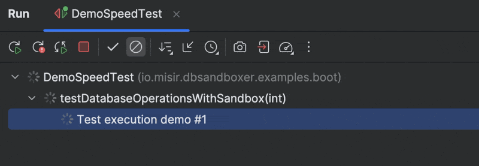

# DbSandboxer

**Fast, isolated database testing for Spring Boot applications using PostgreSQL's template database feature.**


Demo of 100 integration test executions with fresh PostgreSQL databases per test, post Spring Boot initialization:  



## The Problem

Testing with databases is painful:
- **@Transactional rollbacks** hide real database behavior (triggers, constraints don't fire)
- **Truncating tables** is slow and error-prone with complex schemas
- **H2/in-memory databases** don't catch PostgreSQL-specific issues
- **Shared test databases** cause flaky tests due to data pollution

## The Solution

DbSandboxer gives each test its own database copy in ~50ms using PostgreSQL's template databases:

```java
@Test
void test1_createProduct() {
    // Starts with clean database
    productRepo.save(new Product("Laptop", 999));
    assertThat(productRepo.count()).isEqualTo(1);
}

@Test
void test2_verifyIsolation() {
    // Fresh database - no laptop from test1!
    assertThat(productRepo.findByName("Laptop")).isEmpty();
    assertThat(productRepo.count()).isEqualTo(0);
}
```

## Why DbSandboxer?

| Approach | Speed | Real DB Behavior | Maintenance | Isolation |
|----------|-------|------------------|-------------|-----------|
| @Transactional | ✅ Fast | ❌ Fake | ✅ None | ⚠️ Limited |
| Truncate/Delete | ❌ Slow (grows with schema) | ✅ Real | ❌ High | ✅ Full |
| H2 In-Memory | ✅ Fast | ❌ Different DB | ✅ Low | ✅ Full |
| **DbSandboxer** | ✅ Fast (~50ms) | ✅ Real PostgreSQL | ✅ None | ✅ Full |


## Quick Start

### 1. Add Dependency

```xml
<dependency>
    <groupId>io.misir</groupId>
    <artifactId>dbsandboxer-spring-boot-starter-test</artifactId>
    <version>1.0.2</version>
    <scope>test</scope>
</dependency>
```

### 2. Configure Test Database

Add to `src/test/resources/application.yaml`:

```yaml
spring:
  datasource:
    # Required: SimpleDriverDataSource
    type: org.springframework.jdbc.datasource.SimpleDriverDataSource
```

### 3. Enable in Tests

```java
@TestConfiguration(proxyBeanMethods = false)
public class TestConfig {
    @Bean
    @ServiceConnection
    public PostgreSQLContainer<?> postgres() {
        return new PostgreSQLContainer<>("postgres:16-alpine");
    }
}

@SpringBootTest(classes = TestConfig.class)
@EnableDbSandboxer
class OrderServiceTest {
    
    @Autowired
    private OrderRepository orderRepo;
    
    @Test
    void createOrder_persistsSuccessfully() {
        // Each test starts with fresh database
        Order order = new Order("ORD-001", 299.99);
        orderRepo.save(order);
        
        assertThat(orderRepo.count()).isEqualTo(1);
        assertThat(orderRepo.findById(order.getId())).isPresent();
    }
    
    @Test
    void deleteOrder_removesFromDatabase() {
        // No data from previous test - complete isolation
        assertThat(orderRepo.count()).isEqualTo(0);
        
        Order order = orderRepo.save(new Order("ORD-002", 199.99));
        orderRepo.delete(order);
        
        assertThat(orderRepo.count()).isEqualTo(0);
    }
}
```

Check out the [Example project](examples/spring-boot-example) for a complete example.

## How It Works

1. **Template Creation**: Before tests run, DbSandboxer creates a PostgreSQL template database with your schema
2. **Fast Cloning**: Each test gets a fresh copy via `CREATE DATABASE ... WITH TEMPLATE` (file-level copy, not row-by-row)
3. **Automatic Cleanup**: Databases are dropped after each test

This approach is blazing fast because PostgreSQL copies database files directly rather than executing SQL statements.

## Performance

- **Template creation**: One-time cost at test suite start
- **Per-test overhead**: ~50ms regardless of database size
- **Cleanup**: Instant (DROP DATABASE)

Compare to truncating 50 tables with foreign keys: often 500ms+

## Requirements

- Java 17+
- PostgreSQL 12+
- Spring Boot 2.7+ (for Spring Boot integration)

## Modules

- `dbsandboxer-core` - Core functionality
- `dbsandboxer-spring-boot-starter-test` - Spring Boot integration
- `examples` - Complete working examples

## Running the Examples

```bash
# Clone and build
git clone https://github.com/misirio/dbsandboxer.git
cd dbsandboxer
mvn clean install

# Run example tests
cd examples/spring-boot-example
mvn test
```

The examples demonstrate:
- Liquibase migrations
- Test fixtures
- JPA integration
- Complete test isolation

## FAQ

**Q: Why not use @DirtiesContext?**  
A: That recreates the entire Spring context (slow). DbSandboxer only resets the database.

**Q: Can I use connection pools?**  
A: No, use SimpleDriverDataSource. Pools hold connections to dropped databases.

**Q: Does it work with Flyway/Liquibase?**  
A: Yes! Migrations run once during template creation.

**Q: What about test fixtures?**  
A: Load them during template creation - they'll be in every test's copy.

## License

Apache License 2.0

## Contributing

Contributions welcome! Please submit a Pull Request.

## Author

[Fethullah Misir](https://github.com/misirio)